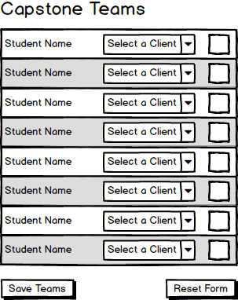
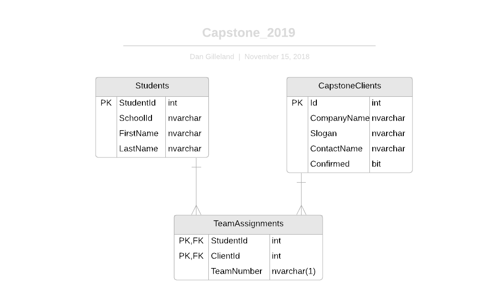

# Capstone 2019

Create an app that allows setting up teams for Capstone 2019. Use the accompanying database script to create the database, and build a form to build-edit the creation of the teams.

## Business Rules:

- The smallest team size is four students
- The largest team size is seven students
- Clients with more than seven students must be broken into separate teams, each with a team letter (starting with 'A').
- Only assign students to clients that have been confirmed as participating.

