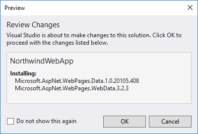
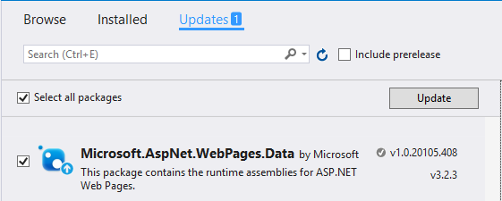

# Accessing Databases with Razor Web Pages

## Setting Up NuGet Packages

To work with databases in bare-bones Razor, you will need a couple of NuGet packages:

- [**Microsoft.AspNet.WebPages.WebData**](https://www.nuget.org/packages/Microsoft.AspNet.WebPages.WebData/)
- [**Microsoft.AspNet.WebPages.Data**](https://www.nuget.org/packages/Microsoft.AspNet.WebPages.Data/)

To get that set up,

1. Right-click on the web application project, and select "Manage NuGet Packages".
2. Click the "Browse" tab and search for/install the two NuGet packages.
3. Perform any updates on NuGet packages that you might need.

## Install a Database

*TBA*

## Adding a Connection String to Web.Config

Open the *web.config* file and add a `<connectionStrings>` section, as shown below.

```xml
<connectionStrings>
  <add name="NorthwindDb"
       connectionString="Data Source=.;Initial Catalog=Northwind_CPSC1517;Integrated Security=true;"
       providerName="System.Data.SqlClient" />
</connectionStrings>
```

----






