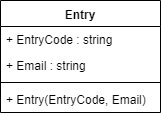
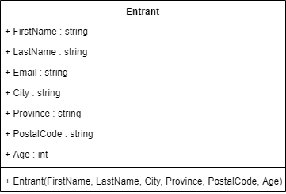
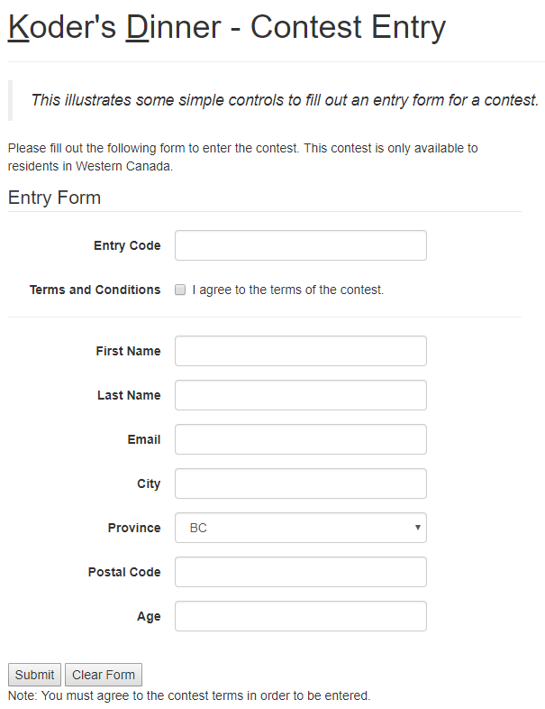

# Contestants Walkthrough

> This walkthrough demo takes you through the creation of a new ASP.NET WebForms application to allow users to enter a contest. It covers
> - Setting up a solution and a web form with commonly used server controls.
> - Using validation controls along with server-side validation.
> - Packaging user input into an object.

## Solution Setup

- New WebForms Application
- Update NuGet Packages
- Add Menu

## Form Setup

- Create data entry form (see image below)
- Create C# classes to hold user input (with greedy constructor)

## Validation Controls

Apply the following validation rules:

- First and Last Name are required.
- Postal Code must be in the correct format: `\D\d\D \d\D\d`
- Email is required.

## Processing User Input

- Validate server-side
  - Also do a manual code-behind check of the AgreeToTerms checkbox.
- Extract user input and create objects.

## Displaying data in a GridView

In the absense of a database, let's echo back the data entry to the user.

- Add a GridView to the form
- Add a static `List<Entry>` property to the code-behind
- Populate the GridView on every submission.

----

