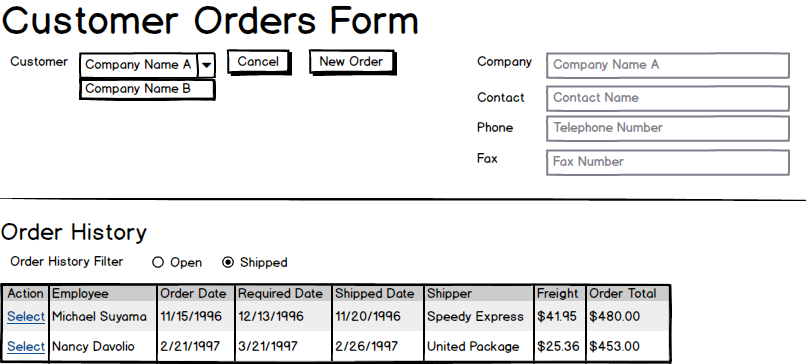
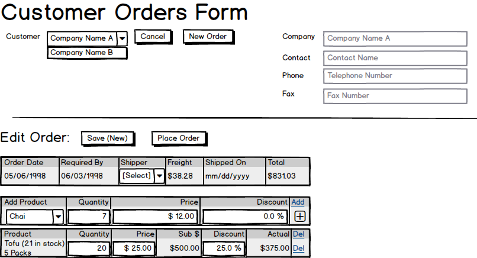
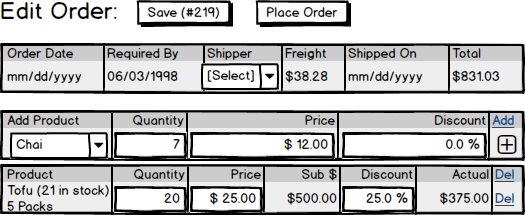

# Customer Orders

From the beginning, customer orders have been entered by the sales representatives at West Wind. Customers would phone or fax in their order, and the sales representative would enter the details into the system. The following diagrams illustrate the process.

## Use Cases

### Page Load

### Selected Customer Order History

### Edit New Order

### Edit Open Order

